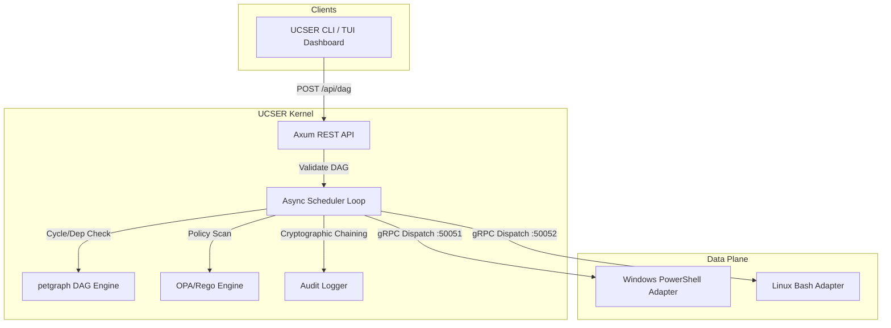

# UCSER — Unified Cross-System Execution Runtime

[](https://github.com/dperry713/ucser-oss/actions)
[](LICENSE)
[](https://github.com/dperry713/ucser-oss/releases)

UCSER is a high-performance, distributed workflow execution engine built in Rust. It compiles structured workflows into Directed Acyclic Graphs (DAGs), validates them against strict policy-as-code guards (using OPA/Rego), executes them concurrently across mixed OS environments (Windows/Linux) via sandboxed gRPC adapters, and registers cryptographically chained, tamper-evident audit logs.

---

## 🏛️ System Architecture

UCSER employs a decoupled architecture separating the API edge layer, the event-driven scheduler, and the adapter execution nodes.



---

## ⚡ Key Features

| Feature | Description | Edition |
| :--- | :--- | :--- |
| **Event-Driven Scheduler** | Asynchronous execution scheduler using `tokio::select!` channels (no busy loops). | **OSS** (Default) |
| **Concurrent Graph execution** | Parallel execution of independent DAG tasks using `petgraph` cycle validation. | **OSS** (Default) |
| **OPA/Rego Policy Guards** | Evaluates tasks against security compliance standards (HIPAA/SOC2 templates) before running. | **OSS** (Default) |
| **Cryptographic Chaining** | SHA-256 block-like hashing of lifecycle events (`audit.ndjson`) to ensure integrity. | **OSS** (Default) |
| **Secure Sandbox Adapters** | gRPC servers with input sanitization, allowed command lists, and process isolation. | **OSS** (Default) |
| **Replay Verification** | Re-computes and verifies the cryptographic audit chain to detect tampering. | **OSS** (Default) |
| **TUI Dashboard** | Terminal user interface for live tracking of workloads and latencies. | **OSS** (Default) |
| **Leader Election & etcd** | Distributed clustering, task routing, node discovery, and High-Availability. | **OSS** (Default) |
| *WORM Ledger Storage* | Write-Once-Read-Many hardware-backed audit integration. | *Enterprise Add-on* |
| *Enterprise RBAC & SSO* | Identity Provider integration (OIDC/SAML) for signed actor workloads. | *Enterprise Add-on* |

---

## 🛠️ Getting Started

### 1. Prerequisites
- **Rust**: Latest stable toolchain.
- **Python**: Version 3.10+ for execution adapters.
- **Protocol Buffers Compiler (`protoc`)**:
  - **Windows**: Run the setup script `powershell -File install_protoc.ps1`.
  - **Linux**: Run `sudo apt-get install protobuf-compiler`.

### 2. Local Setup
Generate gRPC stubs and prepare Python virtual environments:
```bash
# Windows
powershell -File install_python_deps.ps1

# Linux / MacOS
python3 -m venv venv
source venv/bin/activate
pip install grpcio grpcio-tools
python -m grpc_tools.protoc -I./proto --python_out=./adapters/linux --grpc_python_out=./adapters/linux ./proto/execution.proto
```

### 3. Run the System

#### Start Adapters (Data Plane)
```bash
# Start PowerShell Adapter (port 50051)
python adapters/windows/adapter.py

# Start Bash Adapter (port 50052)
python adapters/linux/adapter.py
```

#### Start Kernel (Control Plane)
```bash
# Compile and run kernel in cluster mode
cargo run --bin ucser-kernel

# Run in single-node simulation mode (no adapters required)
cargo run --bin ucser-kernel -- --single-node
```

#### Submit a Workload (CLI)
Submit reference workload and check status:
```bash
# Submit DAG payload
cargo run --bin cli submit examples/reference_workload/phi_pipeline.json

# Check execution trace
cargo run --bin cli status phi-demo-001

# View logs
cargo run --bin cli audit phi-demo-001

# Export compliance logs to CSV
cargo run --bin cli export phi-demo-001 --format csv

# Verify cryptographic log integrity
cargo run --bin cli replay phi-demo-001

# Launch TUI Dashboard
cargo run --bin cli dashboard
```

---

## 🤝 Contributing

Contributions are welcome! Please read our [Contributing Guide](CONTRIBUTING.md) and [Code of Conduct](CODE_OF_CONDUCT.md) for details on our code style, lints (`clippy`), and tests formatting.

## 📄 License
This project is licensed under the MIT License - see the [LICENSE](LICENSE) file for details.
