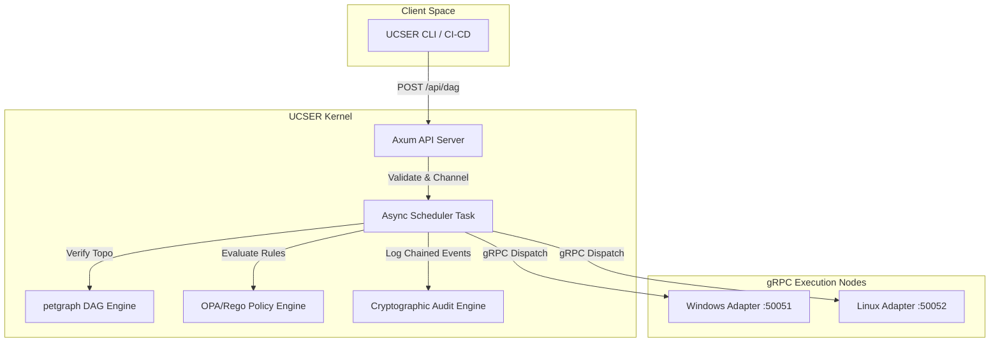
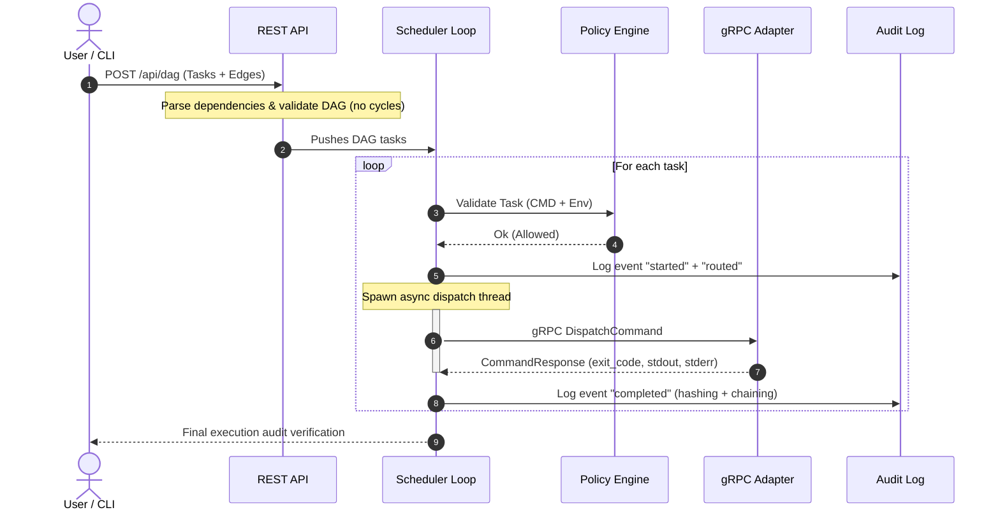

# UCSER Architecture & Design

This document describes the architectural layout, core subsystems, and data flows of the UCSER (Unified Cross-Shell Execution Runtime) platform.

---

## 1. System Overview

UCSER is a secure, cross-platform distributed execution system designed to coordinate automation workloads across mixed OS environments (Windows and Linux) while maintaining cryptographic traceability and policy-as-code enforcement.

---

## 2. Core Subsystems

### 2.1 Async Event-Driven Scheduler
The Scheduler replaces legacy busy loops with a reactive, message-driven architecture built on top of Tokio channels. It handles two primary event streams:
1. **New DAG Submission**: Parses the payload, verifies dependency trees, evaluates security rules, and loads them into the DAG engine.
2. **Task Completion Results**: Receives results from spawned execution threads, marks them completed, logs results cryptographically, and schedules any newly unblocked dependencies.

### 2.2 DAG Engine (using `petgraph`)
Submissions contain tasks and explicit dependency edges. The DAG engine uses `petgraph`'s `DiGraph` to model tasks as nodes and dependencies as edges.
- **Topological Sorting**: Before execution begins, the engine runs `toposort` to detect and reject any cycles or circular dependencies.
- **Concurrent Dispatch**: The scheduler polls ready tasks from the DAG engine. Because it uses asynchronous thread spawning (`tokio::spawn`), independent branches of the DAG execute concurrently.
- **Error & Retries**: Supports maximum retry limits and timeouts on a per-task basis.

### 2.3 Policy Engine (OPA/Rego)
Security policies are written in Rego and loaded dynamically from the `kernel/policies/` directory.
- **Structured Outputs**: Instead of matching outputs on stringified debug printouts, the policy engine evaluates structured `deny[msg]` rules.
- **Rules Mapping**: Violations are mapped to specific, actionable Rust error variants (`PolicyViolation::DisallowedCommand` or `PolicyViolation::RestrictedEnvVar`).

### 2.4 Cryptographic Audit Chaining
Every lifecycle event of a task (route, start, complete, block, fail) is written to a tamper-evident audit ledger (`audit.ndjson`) in NDJSON format.
- **SHA-256 Chaining**: Each log entry contains a `hash` field representing the SHA-256 hash of the current log serialized payload combined with the `prev_hash` of the prior log entry for that execution.
- **Replay Verification**: The CLI includes a `replay` command that recalculates the hash chain sequentially to guarantee the audit log has not been tampered with or modified.

---

## 3. Execution Data Flow

